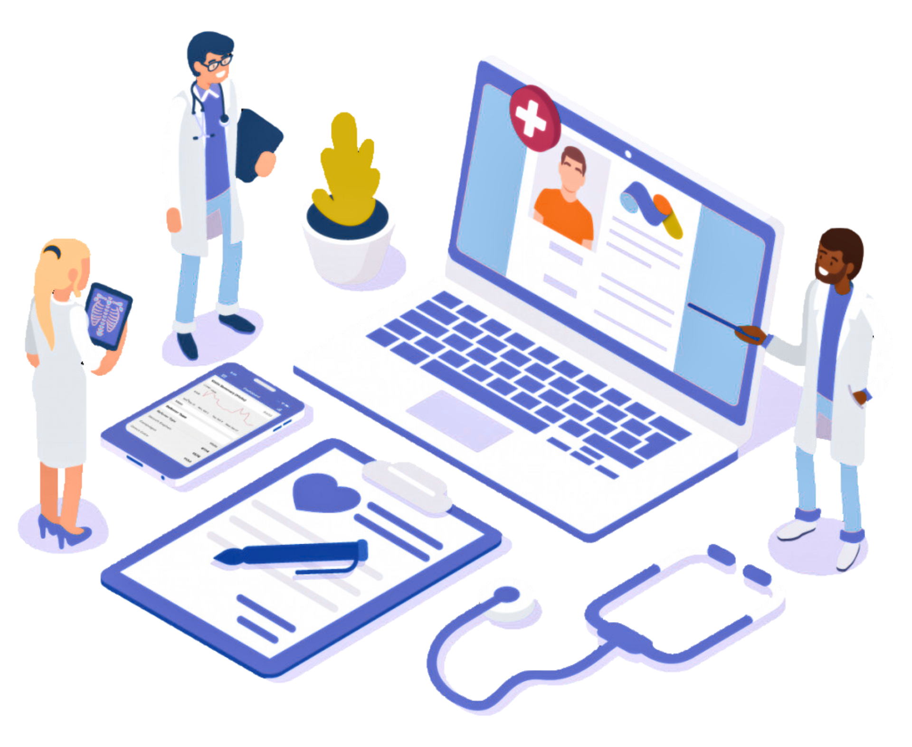

<h1 align="center">Intersecting Health, Policy, and Data</h2>

  
  <h3 align="center">Danielle Aira E. Savellano</h3>

  
  
  

## About Me

Hi, I'm Danielle (Dana)! I'm a passionate data analyst and healthcare advocate currently pursuing my **M.S. in Health Care Analytics and Information Technology** at **Carnegie Mellon University's Heinz College**, where I'm also a **Public Policy and International Affairs Fellow**.

### 🎓 Education

- **M.S. Health Care Analytics and Information Technology** - Carnegie Mellon University (Heinz College)
- **B.S. Biology, Computer Science, and Global Health Studies** - Allegheny College (Summa Cum Laude)
- **Public Policy and International Affairs Fellow** - Carnegie Mellon University

### 🔬 Research & Experience

My mission is to bridge the gap between healthcare and technology through evidence-based, community-focused solutions. My research experience has equipped me with the skills to translate complex data into actionable insights that can improve healthcare outcomes and address real-world challenges.

**Key Areas of Focus:**
- Applications of Artificial Intelligence
- Public Interest Technology
- Telling Stories with Data
- Data-Driven Policy
- Evidence-Based Solutions
- Community-Focused Programming
- Health Care Analytics

### 🌟 Service & Leadership

As a scholar and service leader, I integrate my passion for community into my academic and professional pursuits. I am committed to using technology to address real-world challenges, and to promote equity and justice.

---

  <i>♡ Welcome to my personal portfolio - where health meets data, and data meets impact.</i>

